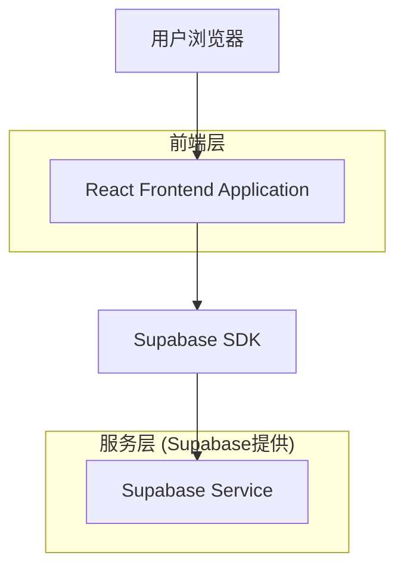

# BLOCKWORLD Web3 Arcade - 技术架构文档

## 1. 架构设计



## 2. 技术描述

- **前端**: React@18 + TypeScript + Tailwind CSS@3 + Vite
- **初始化工具**: vite-init
- **后端**: Supabase (提供认证、数据库、存储)
- **状态管理**: React Context (用于国际化)
- **图标库**: @phosphor-icons/react
- **国际化**: react-i18next

## 3. 路由定义

| 路由 | 目的 |
|-------|---------|
| / | 首页，显示主要内容、导航和英雄区域 |
| /rewards | 奖励页面，显示盲盒和掉落物品 |
| /events | 活动页面，显示当前进行的活动 |
| /leaderboard | 排行榜页面，显示玩家排名 |
| /login | 登录页面，用户认证 |
| /profile | 用户资料页面，显示用户信息和设置 |

## 4. 项目结构

```
src/
├── components/          # 可复用组件
│   ├── layout/
│   │   ├── Navbar.tsx
│   │   └── Footer.tsx
│   ├── home/
│   │   ├── Hero.tsx
│   │   ├── Drops.tsx
│   │   ├── AhaDemo.tsx
│   │   ├── Steps.tsx
│   │   └── Safety.tsx
│   └── ui/
│       ├── Button.tsx
│       ├── Card.tsx
│       └── Accordion.tsx
├── hooks/             # 自定义Hooks
│   ├── useLanguage.ts
│   └── useAnimation.ts
├── contexts/          # React Context
│   └── LanguageContext.tsx
├── locales/           # 国际化文件
│   ├── en.json
│   └── cn.json
├── types/             # TypeScript类型定义
│   └── index.ts
├── utils/             # 工具函数
│   └── animations.ts
├── styles/            # 全局样式
│   └── globals.css
└── App.tsx           # 主应用组件
```

## 5. 组件分解

### 5.1 布局组件

**Navbar.tsx**
- 品牌Logo和名称
- 导航菜单 (Play, Rewards, Events, Leaderboard)
- 语言切换按钮
- 登录按钮
- 移动端响应式菜单

**Footer.tsx**
- 版权信息
- 品牌标识
- 简洁的公司信息

### 5.2 首页组件

**Hero.tsx**
- 欢迎标语和标题
- 主要行动按钮 (Play Now, Watch Gameplay)
- 特色标签 (可提现、真人奖励、前10局免费)
- 互动盲盒卡片

**Drops.tsx**
- 今日掉落标题
- 跑马灯效果展示掉落物品
- 奖励物品图标和描述
- 查看奖励详情链接

**AhaDemo.tsx**
- 惊喜盒子演示
- 点击开启动画效果
- 奖励揭示动画
- 浮动提示消息
- 重新播放功能

**Steps.tsx**
- 三步开始指南
- 图标化步骤说明
- 渐变色彩设计
- 响应式网格布局

**Safety.tsx**
- 安全性和公平性说明
- 真人验证机制
- 防机器人措施
- 学习更多按钮

**FAQ.tsx**
- 手风琴式问答
- 常见问题列表
- 展开/收起动画
- 查看全部FAQ链接

## 6. 状态管理

### 6.1 语言状态管理
使用React Context管理当前语言状态：

```typescript
interface LanguageContextType {
  currentLang: 'en' | 'cn';
  toggleLanguage: () => void;
  t: (key: string) => string;
}
```

### 6.2 动画状态管理
- 使用React的useState管理组件动画状态
- 自定义useAnimation Hook处理复杂动画序列
- CSS类名切换实现动画效果

## 7. 样式策略

### 7.1 Tailwind CSS配置
扩展Tailwind配置以匹配现有设计：

```javascript
{
  colors: {
    surface0: '#FFF7FD',
    surface1: '#FFFFFF',
    ink: '#241A3D',
    subtext: '#6A5E86',
    success: '#2EE59D',
    warning: '#FF9F5A',
    error: '#FF4D6D',
  },
  borderRadius: {
    'pill': '999px',
    'card': '24px',
    'card-sm': '16px',
  },
  animation: {
    'bounce-slow': 'bounce 3s infinite',
    'float': 'float 6s ease-in-out infinite',
    'pulse-slow': 'pulse 4s cubic-bezier(0.4, 0, 0.6, 1) infinite',
    'shake': 'shake 0.5s cubic-bezier(.36,.07,.19,.97) both',
    'pop': 'pop 0.4s cubic-bezier(0.175, 0.885, 0.32, 1.275) forwards',
    'marquee': 'marquee 25s linear infinite',
    'slide-up': 'slideUp 0.3s ease-out forwards',
  }
}
```

### 7.2 自定义组件样式
- 糖果按钮 (btn-candy): 渐变背景、圆角、阴影效果
- 幽灵按钮 (btn-ghost): 半透明背景、边框样式
- 多汁卡片 (card-juicy): 圆角、阴影、悬停效果
- 文本渐变 (text-gradient): 渐变文字颜色

### 7.3 响应式设计
- 移动端优先设计
- 断点: sm (640px), md (768px), lg (1024px)
- 弹性布局和网格系统
- 触摸友好的交互元素

## 8. 国际化实现

### 8.1 语言文件结构
```json
{
  "nav": {
    "play": "Play",
    "rewards": "Rewards",
    "login": "Login"
  },
  "hero": {
    "title1": "Play 60s.",
    "title2": "Open a Box.",
    "subtitle": "Your time finally pays back..."
  }
}
```

### 8.2 翻译函数实现
```typescript
const getNestedTranslation = (obj: any, path: string): string => {
  return path.split('.').reduce((acc, part) => acc && acc[part], obj) || path;
};
```

## 9. 动画系统

### 9.1 CSS动画
- float: 上下浮动效果
- shake: 摇晃动画
- pop: 弹出效果
- marquee: 跑马灯效果
- slide-up: 向上滑入

### 9.2 交互动画
- 按钮悬停: 缩放和颜色变化
- 卡片悬停: 上浮和阴影增强
- 演示动画: 多步骤序列动画
- 提示消息: 随机位置浮动

## 10. 性能优化

### 10.1 代码分割
- 路由级别的代码分割
- 组件懒加载
- 图标按需加载

### 10.2 渲染优化
- React.memo防止不必要的重渲染
- 使用key属性优化列表渲染
- 虚拟滚动处理长列表

### 10.3 资源优化
- 图片压缩和WebP格式
- 字体子集化
- CSS和JS文件压缩

## 11. 开发规范

### 11.1 组件开发规范
- 使用TypeScript严格模式
- 组件props接口定义
- 默认props设置
- 组件文档注释

### 11.2 代码组织
- 单一职责原则
- 组件文件命名使用PascalCase
- Hooks文件命名使用camelCase
- 工具函数模块化

### 11.3 样式规范
- 使用Tailwind类名优先
- 自定义样式使用CSS模块
- 避免内联样式
- 响应式设计优先